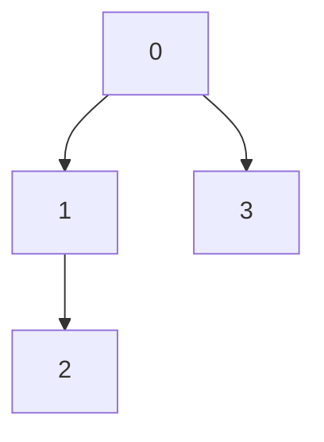

Tree = anything with no cycles

Can test this with math
- Tree should have N nodes and N -1 edges

## How to store trees?
### As a list?
- Label nodes, indexed 0 -> N
- Store as edge list:
```
[(0, 1),
(1,2),
(0, 3)]
```
Creates a tree like:


### As Adjacency List?
- Store a map with nodes and their neighbours
```js
{
	0: [1, 3],
	1: [2],
	2: [],
	3: [],
}
```

### As Adjacency Matrix?
Not great. Giant waste of space given all the nodes that aren't connected.

## Rooted Trees
- Have a designated root node in the tree
- Usually edges point away from this node

## Binary Trees
- Every node has 0-2 children
- Usually artificial

## Binary Search Trees
- BSTs are similar to Binary Trees but
	- values to the left of a node are less than the root
	- values to the right of a node are more or equal to the root
- Good for quick searches

## How to Store Rooted Trees?
- Keep track of current node and also root node at all times
- Sometimes keep pointer to parent as well.
- If we need all these pointers, why not keep a double-linked-list?
- Can also store as flat array....
	- Using tree above...
	- [0, 1, 3, 2] would be the array form. 
	- Index 0 is always the root
	- Index 1 and 2 (values 1 and 3) would be its children
	- Repeat this pattern for more tree layers, leave blanks where a node could be but isn't
	- This really only works for binary trees, because we know where a node *should be*
- 